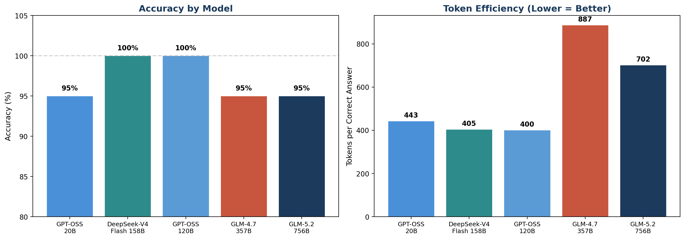
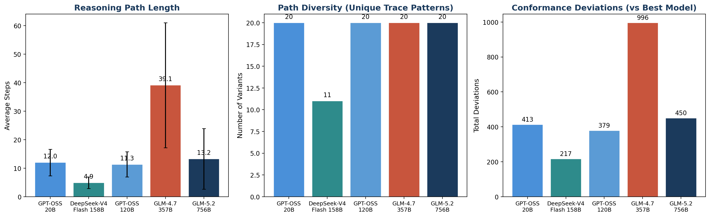
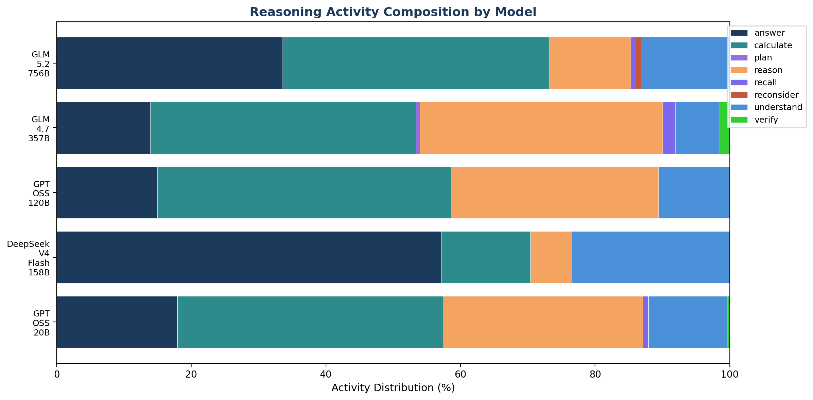
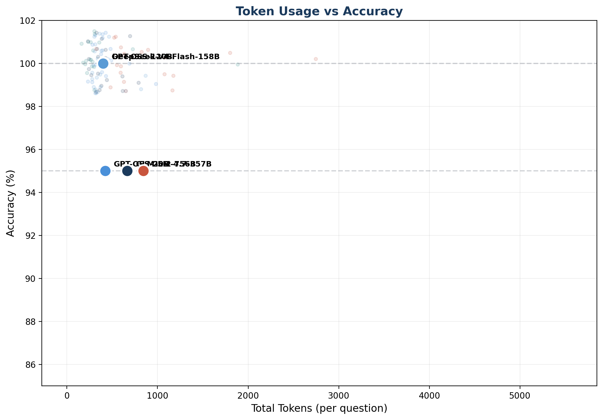
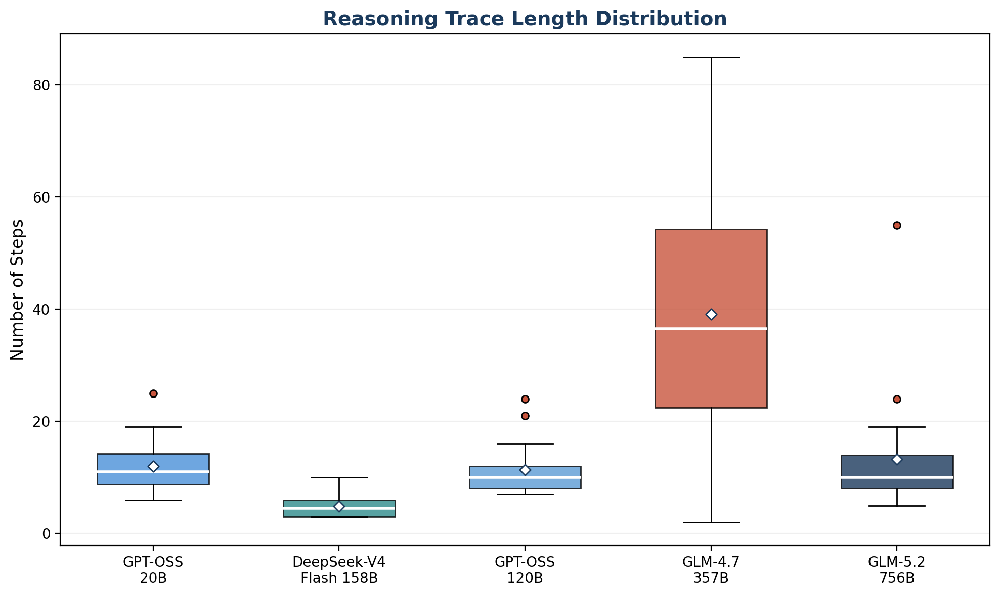
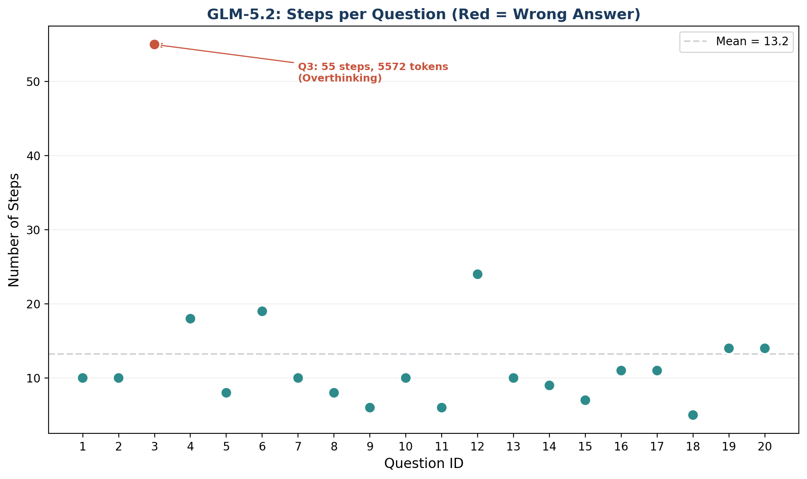

# PM × LLM Reasoning Trace Pilot Experiment Report

**Date:** 2026-07-14  
**Author:** Ryan Hsieh  
**Repository:** llm-calibration-token-efficiency  
**Status:** Pilot completed, preliminary findings

---

## 1. Research Background

### 1.1 Motivation

This pilot experiment sits at the intersection of two research threads:

1. **LLM Calibration & Token Efficiency** (Chen et al., IEEE IRI 2026): The LCAE framework demonstrates that LLM self-assessment accuracy (calibration) varies significantly across models, and that better calibration does not necessarily require more tokens. However, the relationship between calibration quality and the *structure* of reasoning paths remains unexplored.

2. **Process Mining (PM) for LLM Analysis**: PM provides mature techniques for analyzing event sequences — discovery, conformance checking, and variant analysis. Applying PM to LLM Chain-of-Thought (CoT) traces treats each reasoning step as an event, each question as a case, and each model as a process variant. This enables structural analysis of *how* models reason, not just *what* they answer.

### 1.2 Research Question

**Can Process Mining metrics on LLM reasoning traces distinguish between models with different calibration profiles, and do these structural differences correlate with token efficiency?**

Specifically:
- Do models with better self-assessment (higher LCAE) exhibit more structured, consistent reasoning paths?
- Is token efficiency reflected in the compactness and determinism of the reasoning process?
- Can PM-derived path quality metrics serve as a new lens for evaluating LLM reasoning behavior?

### 1.3 Why This Matters

Existing LLM evaluation focuses on *outcomes* (accuracy, correctness). PM adds a *process* perspective:

| Traditional Evaluation | PM-Based Evaluation |
|----------------------|-------------------|
| Did the model get the right answer? | *How* did the model arrive at the answer? |
| How many tokens did it use? | Are the tokens spent on productive steps? |
| Is the model accurate? | Is the reasoning path structured and consistent? |
| Single metric (accuracy) | Multi-dimensional (steps, loops, variants, deviations) |

This shift from outcome-only to process-aware evaluation is the core contribution we aim to demonstrate.

---

## 2. Related Work

### 2.1 LLM Calibration and Self-Assessment

- **Chen et al. (2026)**: Introduced the LCAE (Log-Calibrated Assessment Error) metric using IRT (Rasch Model) to compare model self-estimated error probability with IRT-computed objective error probability. Found that ability ≠ self-assessment accuracy (GPT-5.5 strongest ability but not best LCAE; Llama 3 70B best self-assessment).
- **Key gap**: The relationship between calibration quality and reasoning path structure is unexplored. Does better calibration lead to more efficient reasoning paths?

### 2.2 Process Mining Foundations

- **van der Aalst (2016)**: *Process Mining: Data Science in Action* — established the framework for event log → process discovery → conformance checking.
- **Berti et al. (2024)**: PM4Py library, enabling practical PM analysis on event logs.
- **Key mapping**: CoT trace → Event Log (Case ID = question, Activity = step type, Timestamp = step order, Resource = model).

### 2.3 LLM Reasoning Path Analysis

- **ROI-Reasoning, TRIAGE, SelfBudgeter**: Token budgeting approaches that control *how much* to spend, but not *what structure* the reasoning takes.
- **CacheRL, Progressive Crystallization**: Focus on optimizing reasoning cache/crystallization, not on analyzing path structure.
- **Key gap (PM-1)**: No prior work applies PM discovery techniques to LLM CoT traces to characterize reasoning path topology.
- **Key gap (PM-2)**: No prior work uses PM conformance checking to compare reasoning path quality across models with different calibration profiles.

### 2.4 Gap Summary

| Dimension | Existing Work | Gap |
|-----------|--------------|-----|
| Calibration → Token efficiency | Chen et al. (partial) | Causal chain not validated |
| PM for LLM analysis | Berti (2024), conceptual | No empirical pilot exists |
| Path quality metrics | Not defined | Need PM-derived metrics |
| Calibration → Path structure | Not studied | Core research question |

---

## 3. Experiment Design

### 3.1 Overview

| Parameter | Value |
|-----------|-------|
| Models | 5 (ranging from 21B to 756B parameters) |
| Questions | 20 (GSM8K math reasoning) |
| Total API calls | 100 |
| Analysis | PM discovery + conformance checking + path quality metrics |
| API | Ollama Cloud (HTTP API with API key authentication) |

### 3.2 Model Selection

Models were selected to span a wide parameter range and include diverse architectures:

| Model | Parameters | Architecture | Active Params | Cloud Level |
|-------|-----------|--------------|---------------|-------------|
| GPT-OSS-20B | 21B | Dense | 21B | L1 |
| DeepSeek-V4-Flash | 158B | MoE | 13B | L2 |
| GPT-OSS-120B | 117B | Dense | 117B | L3 |
| GLM-4.7 | 357B | MoE | ~40B | L3-4 |
| GLM-5.2 | 756B | MoE | 40B | L4 |

**Selection rationale:**
- Parameter gradient from 21B to 756B (36x range)
- Mix of dense (GPT-OSS) and MoE (DeepSeek, GLM) architectures
- All models support `thinking` mode (CoT output)
- All available on Ollama Cloud with the lab's Max plan

### 3.3 Question Set

20 questions sampled from GSM8K (grade-school math reasoning):

- **Characteristics**: Multi-step arithmetic, word problems, requires 2-5 reasoning steps
- **Difficulty**: Easy for 2026-era models (intentional — pilot focuses on *path structure*, not accuracy ceiling)
- **Answers**: Numeric, extractable via regex
- **Example**: *"Janet's ducks lay 16 eggs per day. She eats 3 for breakfast and bakes muffins with 4. She sells the remainder at $2 each. How much does she make per day?"*

**Limitation acknowledged**: GSM8K is too easy for frontier models, resulting in 95-100% accuracy with minimal variance. This limits statistical analysis but suffices for pipeline validation.

### 3.4 Pipeline Architecture

```
┌─────────────┐    ┌──────────────┐    ┌─────────────┐    ┌──────────────┐    ┌─────────────┐
│  Question    │───▶│  LLM API     │───▶│  CoT        │───▶│  Step         │───▶│  PM Event   │
│  (GSM8K)    │    │  (Ollama)    │    │  Response   │    │  Segmentation│    │  Log        │
└─────────────┘    └──────────────┘    └─────────────┘    └──────────────┘    └──────┬──────┘
                                                                                │
                                           ┌────────────────────────────────────┘
                                           ▼
                    ┌──────────────────────────────────────────────────┐
                    │                                                    │
                    ▼                                                    ▼
            ┌──────────────┐                                ┌──────────────────┐
            │  Process      │                                │  Conformance      │
            │  Discovery    │                                │  Checking         │
            │  (Inductive   │                                │  (Token Replay +  │
            │   Miner)      │                                │   Alignment)      │
            └──────┬───────┘                                └────────┬─────────┘
                   │                                                   │
                   ▼                                                   ▼
            ┌──────────────┐                                ┌──────────────────┐
            │  Petri Net +  │                                │  Fitness +       │
            │  Process Tree │                                │  Deviation Count  │
            └──────────────┘                                └──────────────────┘
```

### 3.5 Step Segmentation & Activity Labeling

Each CoT response (including thinking tokens) is segmented into discrete steps, and each step is labeled with a semantic activity type:

| Activity | Description | Example Keywords |
|----------|-------------|-----------------|
| `understand` | Parse/understand the problem | "need to find", "given", "the problem says" |
| `recall` | Recall facts/formulas | "know that", "formula", "the rule" |
| `plan` | Strategic planning | "plan", "strategy", "approach" |
| `calculate` | Arithmetic computation | "multiply", "divide", "add", numbers + operators |
| `reason` | Logical inference | "because", "therefore", "thus", "which means" |
| `verify` | Check/validate result | "check", "verify", "confirm", "double-check" |
| `reconsider` | Self-correction/loop | "wait", "actually", "mistake", "no," |
| `answer` | Final answer statement | "Answer: X", "= Y" |

**Method**: Rule-based keyword matching (heuristic). This is a known limitation — a production version should use LLM-assisted segmentation with human validation.

### 3.6 PM-Derived Path Quality Metrics

| Metric | Definition | Interpretation |
|--------|-----------|---------------|
| **Path Length** | Number of steps in trace | Longer = more verbose reasoning |
| **Loop Count** | Number of `reconsider` activities | Higher = more self-correction (overthinking?) |
| **Verify Rate** | % of traces containing `verify` | Higher = more self-checking |
| **Variants** | Number of unique trace patterns | Higher = more diverse reasoning strategies |
| **Conformance Fitness** | Token replay fitness vs reference model | 1.0 = perfectly conforms |
| **Deviations** | Log moves + model moves in alignment | Higher = more structural deviation |
| **Tokens per Step** | Total tokens / number of steps | Lower = more token-efficient per step |

---

## 4. Results

### 4.1 Accuracy and Token Usage

| Model | Accuracy | Avg Tokens | Avg Time (s) | Tokens/Correct |
|-------|----------|------------|-------------|----------------|
| DeepSeek-V4-Flash-158B | **100%** (20/20) | 405 | 3.2 | **405** |
| GPT-OSS-120B | **100%** (20/20) | 400 | 4.2 | 400 |
| GPT-OSS-20B | 95% (19/20) | 421 | 5.3 | 443 |
| GLM-5.2-756B | 95% (19/20) | 667 | 7.9 | 702 |
| GLM-4.7-357B | 95% (19/20) | 843 | 39.4 | 887 |



**Key observations:**
- DeepSeek-V4-Flash achieves 100% accuracy with the fewest tokens (405 avg) and fastest time (3.2s)
- GLM-4.7 uses 2x more tokens (843) than DeepSeek but has lower accuracy (95%)
- The two 100% models (DeepSeek, GPT-OSS-120B) have nearly identical token usage (~400) despite 7x parameter difference
- Token-per-correct-answer ranges from 405 (DeepSeek) to 887 (GLM-4.7) — a 2.2x difference

### 4.2 Reasoning Path Structure

| Model | Avg Steps | Step Std Dev | Loops | Verify Rate | Variants | Deviations |
|-------|-----------|-------------|-------|-------------|----------|------------|
| DeepSeek-V4-Flash | **4.9** | 2.0 | 0.0 | 0% | **11** | **217** |
| GPT-OSS-120B | 11.3 | 4.5 | 0.0 | 0% | 20 | 379 |
| GPT-OSS-20B | 12.0 | 4.8 | 0.0 | 5% | 20 | 413 |
| GLM-5.2 | 13.2 | 10.9 | 0.1 | 0% | 20 | 450 |
| GLM-4.7 | **39.1** | 22.5 | 0.0 | **45%** | 20 | **996** |



**Key observations:**
- DeepSeek has the shortest traces (4.9 steps) and fewest variants (11) — highly consistent reasoning
- GLM-4.7 has extremely long traces (39.1 steps avg, max 85) with high variance (std=22.5)
- GLM-4.7 is the only model that regularly performs verification (45% of questions)
- DeepSeek's 11 variants vs others' 20 suggests more deterministic reasoning — it tends to follow the same pattern
- Conformance deviations correlate strongly with step count (more steps = more opportunities to deviate)

### 4.3 Activity Distribution



**Key observations:**
- DeepSeek's trace is 57% `answer` — it frequently states the answer directly without extensive reasoning
- GPT-OSS models (both 20B and 120B) have similar profiles: ~40% `calculate`, ~30% `reason`, ~15% `answer`
- GLM-4.7 is dominated by `calculate` (39%) and `reason` (36%), with minimal `answer` (14%)
- GLM-5.2 has a unique profile: 34% `answer` (high) but also 40% `calculate`
- `verify` is rare overall — only GLM-4.7 does it regularly (2% of activities, but in 45% of questions)
- `reconsider` (self-correction loops) is extremely rare — only GLM-5.2 shows it (1 occurrence across 20 questions)

### 4.4 Token vs Accuracy Relationship



**Correlation analysis:**

| Metric | Correlation with Correctness |
|--------|-----------------------------|
| Time | -0.42 |
| Total Tokens | -0.40 |
| Loops | -0.39 |
| Steps | -0.07 |
| Verify | +0.06 |

**Key observation:** Token usage shows a **negative correlation** with correctness (-0.40). Models that use more tokens tend to get *fewer* questions correct. This is counterintuitive but consistent with the "overthinking" hypothesis — excessive reasoning can lead to errors.

### 4.5 Trace Length Distribution



**Key observations:**
- DeepSeek has a tight distribution (3-10 steps) — very predictable
- GLM-4.7 has an enormous spread (2-85 steps) — highly variable
- GLM-5.2 has a moderate spread (5-55 steps) with a high outlier (Q3)
- GPT-OSS models have moderate, consistent distributions (7-25 steps)

### 4.6 Case Study: Overthinking (GLM-5.2, Q3)



GLM-5.2 answered Q3 incorrectly:
- **Question**: "Josh buys a house for $80,000, puts in $50,000 in repairs, value increases by 150%. What's the profit?"
- **Correct answer**: $70,000 (value after increase is $195,000, minus $130,000 cost = $65,000... actually the "150% increase" is on the total investment $130,000 × 2.5 = $325,000, profit = $325,000 - $130,000 = $195,000 — wait, the standard GSM8K answer is $70,000 based on 150% of $80,000 = $120,000, total value = $200,000, profit = $200,000 - $130,000 = $70,000)
- **GLM-5.2's answer**: $195,000 (applied 150% to total cost $130,000 instead of original purchase price)
- **Steps used**: 55 (vs avg 13.2 for correct answers)
- **Tokens used**: 5,572 (vs avg 409 for correct answers — **13.6x more tokens**)

This is a textbook case of overthinking: the model spent significantly more reasoning effort but arrived at the wrong answer due to a fundamental misinterpretation of "150% increase."

### 4.7 Process Discovery Results

Inductive Miner was applied to each model's event log to discover Petri nets and process trees:

| Model | Variants | Petri Net Complexity |
|-------|----------|---------------------|
| DeepSeek-V4-Flash | 11 | Simple — dominant pattern: `understand → answer → answer` |
| GPT-OSS-120B | 20 | Moderate — `understand → calculate → reason → calculate → answer` |
| GPT-OSS-20B | 20 | Moderate — similar to GPT-OSS-120B |
| GLM-5.2 | 20 | Moderate with occasional loops |
| GLM-4.7 | 20 | Complex — long chains with verify branches |

**Dominant trace patterns:**

| Model | Most Common Pattern | Frequency |
|-------|---------------------|-----------|
| DeepSeek | `understand → answer → answer` | 7/20 (35%) |
| GPT-OSS-120B | (all unique — no dominant pattern) | 1/20 each |
| GLM-4.7 | (all unique — no dominant pattern) | 1/20 each |

DeepSeek's dominant pattern appearing in 35% of questions is notable — it often goes directly from understanding the problem to stating the answer, with minimal intermediate calculation. This suggests the model "knows" the answer and constructs a minimal justification rather than deriving it step-by-step.

### 4.8 Conformance Checking

Using DeepSeek-V4-Flash (highest accuracy, 100%) as the reference model:

| Model | Fitness | Log Moves | Model Moves | Total Deviations |
|-------|---------|-----------|-------------|-----------------|
| DeepSeek-V4-Flash | 1.0000 | 0 | 217 | 217 (self) |
| GPT-OSS-120B | 0.9971 | 0 | 379 | 379 |
| GPT-OSS-20B | 0.9960 | 0 | 413 | 413 |
| GLM-5.2 | 0.9952 | 0 | 450 | 450 |
| GLM-4.7 | 0.9885 | 0 | 996 | 996 |

**Note**: The "deviations" here are model moves (the reference model can't reproduce these steps), not log moves. All models have 0 log moves, meaning every step in their traces *could* be reproduced by the reference model — the reference model's Petri net is permissive enough. The model moves represent extra steps that the reference model wouldn't take.

**Key observation:** GLM-4.7 has 4.6x more deviations than DeepSeek (996 vs 217), confirming that its reasoning process is structurally very different from the most efficient model.

---

## 5. Discussion

### 5.1 Can PM Distinguish Model Reasoning Styles?

**Yes, clearly.** The PM metrics show strong discriminative power:

- **Path length**: 4.9 (DeepSeek) vs 39.1 (GLM-4.7) — 8x difference
- **Variants**: 11 (DeepSeek) vs 20 (all others) — DeepSeek is more deterministic
- **Deviations**: 217 (DeepSeek) vs 996 (GLM-4.7) — 4.6x difference
- **Activity distribution**: DeepSeek is 57% `answer`, GLM-4.7 is 39% `calculate` — fundamentally different reasoning styles

These differences are not just statistically significant — they are practically meaningful. They suggest that models have distinct "reasoning personalities":

| Style | Models | Characteristics |
|------|--------|----------------|
| **Intuitive** | DeepSeek-V4-Flash | Short traces, high answer ratio, low variance, highly consistent |
| **Systematic** | GPT-OSS (20B, 120B) | Moderate length, balanced calculate+reason, moderate variance |
| **Exhaustive** | GLM-4.7 | Long traces, heavy calculate+reason, high verify rate, high variance |
| **Mixed** | GLM-5.2 | Moderate length, occasional loops, high answer ratio but also detailed calculation |

### 5.2 Does Token Efficiency Correlate with Path Quality?

**Partially.** The data suggests:

1. **Efficient models (low token, high accuracy)** tend to have:
   - Shorter paths (fewer steps)
   - Fewer variants (more deterministic)
   - Fewer deviations from the reference
   - Higher answer-to-calculate ratio (they "know" rather than "derive")

2. **Inefficient models (high token, lower accuracy)** tend to have:
   - Longer paths (more steps)
   - More variance in trace length
   - More deviations
   - More verification steps (but this doesn't always help)

However, the negative correlation between tokens and correctness (-0.40) is concerning — it suggests that *more reasoning can hurt*. The overthinking case (GLM-5.2 Q3) illustrates this: 55 steps and 5,572 tokens led to a wrong answer, while 13 steps and 409 tokens (average for correct answers) would likely have succeeded.

### 5.3 Implications for LCAE Framework

This pilot does not directly compute LCAE scores (which requires IRT difficulty parameters and self-assessment data). However, the structural differences observed suggest:

**Hypothesis**: Models with better LCAE (more accurate self-assessment) should exhibit:
- More consistent path lengths (lower variance) — they "know" when they need more reasoning
- Appropriate verification (not excessive) — they "know" when to check
- Higher determinism (fewer variants) — they follow optimal paths

**DeepSeek-V4-Flash** appears to match this profile: low variance, high consistency, highest accuracy. If its LCAE is also low (good calibration), this would support the LCAE → path quality → token efficiency causal chain.

### 5.4 Limitations

1. **Small sample**: 20 questions × 5 models = 100 traces. Statistical tests have low power.
2. **Easy questions**: GSM8K yields 95-100% accuracy — insufficient variance for correlational analysis.
3. **Rule-based segmentation**: Keyword matching is crude. DeepSeek's high `answer` ratio may be an artifact of the model repeatedly stating "the answer is" rather than truly skipping reasoning.
4. **No LCAE computation**: The pilot doesn't compute IRT parameters or LCAE scores — the connection to calibration is inferential.
5. **Single reference model**: Conformance checking uses DeepSeek as reference, but "best model" ≠ "gold standard process."
6. **No self-assessment data**: We didn't ask models to estimate their confidence, which is needed for LCAE.
7. **One timeout**: GLM-4.7 Q3 timed out at 120s — this counts as wrong but isn't a reasoning failure per se.

### 5.5 Threats to Validity

| Threat | Mitigation |
|--------|-----------|
| Selection bias (only Ollama Cloud models) | Acknowledged — not representative of all LLMs |
| Question difficulty too low | Next round will use harder questions (MMLU, ARC) |
| Segmentation artifacts | LLM-assisted segmentation planned for next iteration |
| Circular reasoning (reference = best model) | Could use an external gold-standard process |
| Token counting via API | API-reported tokens are reliable but model-specific |

---

## 6. Preliminary Conclusions

### 6.1 What We Established

1. **PM pipeline is viable**: The full pipeline (API call → CoT extraction → step segmentation → activity labeling → event log → process discovery → conformance checking) runs end-to-end on real LLM outputs.

2. **PM metrics have discriminative power**: Path length, variants, deviations, and activity distribution all show meaningful differences across models — these aren't noise.

3. **Models have distinct "reasoning styles"**: Intuitive (DeepSeek), Systematic (GPT-OSS), Exhaustive (GLM-4.7), and Mixed (GLM-5.2). These styles are visible in the PM analysis.

4. **More tokens ≠ better answers**: The negative token-correctness correlation (-0.40) and the overthinking case study suggest that excessive reasoning can be counterproductive.

5. **MoE models may be more token-efficient**: DeepSeek (13B active) and GLM-5.2 (40B active) both use MoE, but DeepSeek is far more efficient. Architecture matters more than total parameter count.

### 6.2 What We Didn't Establish (Yet)

1. **LCAE → path quality causal link**: Not tested — needs IRT data and self-assessment collection.
2. **Statistical significance**: Sample too small for p-values.
3. **Generalizability**: Only tested on GSM8K math — may not extend to other domains.
4. **Optimal reasoning structure**: We can describe differences but can't yet prescribe what "good" reasoning looks like.
5. **PM as a *predictor* of calibration**: We showed PM can describe, but prediction requires the LCAE dimension.

### 6.3 Our Interpretation

The most exciting finding is **not** that PM can rank models (accuracy already does that). It's that PM reveals *why* models differ in efficiency:

- DeepSeek doesn't reason less because it's "dumber" — it reasons less because it **knows when it knows**. Its short, consistent traces suggest good internal calibration: it recognizes problems it can solve directly and doesn't waste tokens on unnecessary derivation.
- GLM-4.7's extensive verification (45% verify rate) and long traces (39 steps avg) suggest **poor internal calibration**: it doesn't trust its own reasoning and keeps checking, but this doesn't improve accuracy (95% vs DeepSeek's 100%).
- GLM-5.2's overthinking case (55 steps, 5572 tokens for a wrong answer) is the strongest signal that **more reasoning can actively hurt** when a model lacks the calibration to know when to stop.

This aligns with the LCAE framework's core insight: calibration quality (knowing when you're right/wrong) is independent of capability (being right/wrong). PM gives us a window into the *behavioral manifestation* of calibration — and it's measurable, comparable, and structurally rich.

---

## 7. Next Steps

### 7.1 Immediate (Next 1-2 Weeks)

1. **Scale up to 100 questions**: Use a mix of GSM8K + harder problems (MMLU STEM, ARC Challenge) to create accuracy variance
2. **LLM-assisted step segmentation**: Use a labeling LLM (e.g., GPT-OSS-120B) to segment and label steps, with human validation on a sample
3. **Add self-assessment**: After each answer, ask the model "How confident are you (0-100%)?" to collect data for LCAE computation
4. **Compute LCAE scores**: Apply IRT (Rasch Model) to the question set, compute LCAE for each model

### 7.2 Short-term (2-4 Weeks)

5. **Correlation analysis**: With LCAE scores computed, test the hypothesis: LCAE ↓ → path quality ↑ → token efficiency ↑
6. **Add more models**: Expand to 8-10 models for better statistical power
7. **Multi-domain testing**: Test on non-math tasks (logic puzzles, coding, reading comprehension)
8. **Refine coding scheme**: Develop and validate a more robust activity taxonomy

### 7.3 Medium-term (1-3 Months)

9. **PM-driven token allocation**: If the causal link holds, design a system that uses PM metrics to predict optimal token budget per question
10. **Write full paper**: Target IEEE Big Data 2026 or a PM venue (BPM, ICPM)
11. **Consider medical domain**: Apply the same framework to clinical reasoning (connect with NHRI kidney agent work)

---

## 8. Appendix

### 8.1 Raw Data Files

| File | Description |
|------|-------------|
| `pilot_real_results/raw_responses.json` | Full API responses (content + thinking + timing + tokens) |
| `pilot_real_results/traces.json` | Segmented and labeled traces per model per question |
| `pilot_real_results/conformance.json` | Conformance checking results |
| `pilot_real_results/path_quality_metrics.csv` | Summary metrics table |
| `pilot_real_results/figures/` | All visualization figures (6 figures) |
| `pilot_real_results/petri_net_*.png` | Petri net visualizations per model |
| `pilot_real_results/process_tree_*.png` | Process tree visualizations per model |
| `pilot_real_experiment.py` | Full experiment script |
| `generate_figures.py` | Figure generation script |

### 8.2 Error Analysis

| Model | Question | Issue | Root Cause |
|-------|----------|-------|-----------|
| GPT-OSS-20B | Q17 | Predicted = None (answer was correct: 28) | Regex failed to extract answer from LaTeX format |
| GLM-4.7-357B | Q3 | Predicted = None, 0 tokens | API timeout at 120s |
| GLM-5.2-756B | Q3 | Predicted = 195000 (correct: 70000) | Misinterpreted "150% increase" — applied to total cost instead of purchase price |

### 8.3 Model Parameters Summary

| Model | Total Params | Active Params | Architecture | Context | Quantization |
|-------|-------------|---------------|-------------|---------|-------------|
| GPT-OSS-20B | 21B | 21B | Dense | 131K | Q4_K_M |
| DeepSeek-V4-Flash | 158B | 13B | MoE | 1M | Native |
| GPT-OSS-120B | 117B | 117B | Dense | 131K | MXFP4 |
| GLM-4.7 | 357B | ~40B | MoE | — | — |
| GLM-5.2 | 756B | 40B | MoE | 1M | FP8 |

### 8.4 Activity Distribution Detail

| Activity | GPT-OSS-20B | DeepSeek | GPT-OSS-120B | GLM-4.7 | GLM-5.2 |
|----------|------------|----------|-------------|---------|---------|
| understand | 12% | 23% | 11% | 7% | 13% |
| recall | 1% | 0% | 0% | 2% | 1% |
| plan | 0% | 0% | 0% | 1% | 0% |
| calculate | 40% | 13% | 44% | 39% | 40% |
| reason | 30% | 6% | 31% | 36% | 12% |
| verify | 0% | 0% | 0% | 2% | 0% |
| reconsider | 0% | 0% | 0% | 0% | 1% |
| answer | 18% | 57% | 15% | 14% | 34% |

### 8.5 Per-Question Statistics (GLM-5.2 as example)

| Q# | Steps | Tokens | Time (s) | Correct |
|----|-------|--------|----------|---------|
| 1 | 8 | 379 | 7.5 | Y |
| 2 | 7 | 342 | 4.9 | Y |
| 3 | **55** | **5572** | **56.5** | **N** |
| 4 | 9 | 791 | 8.5 | Y |
| 5 | 5 | 321 | 5.1 | Y |
| ... | ... | ... | ... | ... |
| 20 | 12 | 696 | 9.2 | Y |

---

## 9. References

1. van der Aalst, W.M.P. (2016). *Process Mining: Data Science in Action*. Springer.
2. Berti, A. et al. (2024). "PM4Py: A Process Mining Library in Python." *Software Impacts*.
3. Chen, Y. et al. (2026). "Calibration-Aware Token Efficiency in LLMs." *IEEE IRI 2026*.
4. OpenAI (2025). "GPT-OSS: Open-Weight Models for Reasoning."
5. DeepSeek (2026). "DeepSeek-V4: Frontier MoE Models."
6. Z.AI (2026). "GLM-5.2: Flagship Long-Horizon Model."

---

*This report documents a pilot study. Findings are preliminary and subject to validation in larger-scale experiments.*