# PM × LLM Reasoning Trace Experiment v2 Report

**Date:** 2026-07-15 (revised)  
**Author:** Ryan Hsieh  
**Repository:** llm-calibration-token-efficiency  
**Status:** Experiment completed, confidence re-evaluated

> **Reproducibility notice (2026-07-24):** The original inputs needed to
> regenerate the final V2 tables are not present in this repository. The
> committed DeepSeek-reference conformance file used an incorrect alignment
> deviation field, and the committed entropy analysis used an asymmetric
> sampled-distance matrix and Jensen–Shannon distance labeled as divergence.
> The code has been corrected, but the numerical conformance, Levenshtein, JSD,
> and downstream conclusions in this report remain historical and must not be
> treated as validated until `python scripts/check_v2_results.py` passes after
> a full rerun.

---

## 1. Research Background

### 1.1 Motivation

This experiment is the second iteration of a pilot study exploring the intersection of Process Mining (PM) and LLM reasoning analysis. Building on the v1 pilot (20 GSM8K questions, 5 models), v2 addresses two key limitations:

1. **Question difficulty ceiling**: V1 used GSM8K (grade-school math), yielding 95–100% accuracy with insufficient variance for correlational analysis. V2 uses harder benchmarks (MMLU STEM + ARC Challenge) to create meaningful accuracy variation.

2. **No self-assessment data**: V1 did not collect model confidence estimates. V2 adds a confidence self-assessment step, enabling calibration analysis (Brier score, confidence gap) alongside PM structural metrics.

The overarching research question remains: **Can Process Mining metrics on LLM reasoning traces distinguish between models with different calibration profiles, and do these structural differences correlate with token efficiency?**

### 1.2 What Changed from V1

| Dimension | V1 (Pilot) | V2 (This Experiment) |
|-----------|-----------|---------------------|
| Questions | 20 (GSM8K math) | 100 (50 MMLU STEM + 50 ARC Challenge) |
| Difficulty | Easy (95–100% accuracy) | Moderate (56–98% accuracy) |
| Self-assessment | None | Confidence rating 0–100% per question (with context) |
| Calibration | Not computed | Brier score, confidence gap, avg confidence |
| Activities | 8 types | 9 types (added `evaluate`) |
| PM conformance | Alignment (all models) | Alignment (4 models) |
| Models | 5 | 4 (GLM-4.7 removed due to model retirement) |

### 1.3 Confidence Prompt Revision

An initial version of this experiment used a context-free confidence prompt ("You answered D. How confident are you?"). This produced degenerate results — models without conversation context returned 0 or uninterpretable values. The revised prompt provides the original question, the model's full response, and its predicted answer as context:

> **User:** [original question with choices]  
> **Assistant:** [model's reasoning, truncated to 1000 chars]  
> **User:** You previously answered "{predicted_answer}" for this question. Based on your reasoning, how confident are you that "{predicted_answer}" is the correct answer? Give ONLY a single number from 0 to 100.

This multi-turn format ensures the model has full context to assess its own confidence. All calibration results in this report use the revised prompt.

---

## 2. Related Work

### 2.1 LLM Calibration and Self-Assessment

- **Chen et al. (2026)**: Introduced the LCAE (Log-Calibrated Assessment Error) metric using IRT (Rasch Model). Found that model capability ≠ self-assessment accuracy. Key insight: some models "know when they know" and others don't.
- **GPT-OSS (2025)** and **GLM-5.2 (2026)**: Modern models support explicit `thinking` mode, producing structured CoT traces amenable to PM analysis.
- **Gap**: No prior work connects calibration quality to the *structural properties* of reasoning paths.

### 2.2 Process Mining Foundations

- **van der Aalst (2016)**: Established the event log → discovery → conformance checking framework.
- **Berti et al. (2024)**: PM4Py library for practical PM analysis in Python.
- **Key mapping**: CoT trace → Event Log (Case ID = question, Activity = step type, Timestamp = step order, Resource = model).

---

## 3. Experiment Design

### 3.1 Overview

| Parameter | Value |
|-----------|-------|
| Models | 4 (21B to 756B parameters) |
| Questions | 100 (50 MMLU STEM + 50 ARC Challenge) |
| Analysis | PM discovery + conformance checking + calibration metrics |
| API | Ollama Cloud (HTTP API with API key) |
| Reference model | GLM-5.2-756B (highest accuracy, 98%) |

### 3.2 Model Selection

| Model | Parameters | Architecture | Active Params | Cloud Level |
|-------|-----------|--------------|---------------|-------------|
| GPT-OSS-20B | 21B | Dense | 21B | L1 |
| DeepSeek-V4-Flash | 158B | MoE | 13B | L2 |
| GPT-OSS-120B | 117B | Dense | 117B | L3 |
| GLM-5.2 | 756B | MoE | 40B | L4 |

**Selection rationale:** Span a wide parameter range, mix dense and MoE architectures, all support `thinking` mode.

> **Note:** GLM-4.7-357B was originally included but was retired from Ollama Cloud on 2026-07-15, preventing confidence re-evaluation. It has been removed from all analysis.

### 3.3 Question Set

**MMLU STEM (50 questions):** Drawn from 8 subjects — Abstract Algebra, College Mathematics, College Physics, Formal Logic, High School Mathematics, High School Physics, High School Statistics, Machine Learning.

**ARC Challenge (50 questions):** Grade-school science reasoning, multiple-choice. ARC Challenge contains "challenge" problems that test models harder than standard science questions.

### 3.4 Pipeline Architecture

```
Question → LLM API (with thinking) → CoT Response → Confidence Self-Assessment (multi-turn) → Step Segmentation
                                                                                                    │
                                    ┌───────────────────────────────────────────────────────────────┤
                                    ▼                                                               ▼
                              PM Event Log                                                   Calibration Analysis
                              (Inductive Miner)                                              (Brier, Gap, Avg Conf)
                                    │
                                    ▼
                              Petri Net + Conformance Checking
                              (Alignment vs reference model)
```

### 3.5 Step Segmentation & Activity Labeling

Each CoT response (including thinking tokens) is segmented into discrete steps with semantic activity labels:

| Activity | Description | Example Keywords |
|----------|-------------|-----------------|
| `understand` | Parse/understand the problem | "need to find", "given", "the problem says" |
| `recall` | Recall facts/formulas | "know that", "formula", "the rule" |
| `plan` | Strategic planning | "plan", "strategy", "approach" |
| `calculate` | Arithmetic computation | "multiply", "divide", "add", numbers + operators |
| `reason` | Logical inference | "because", "therefore", "thus", "which means" |
| `evaluate` | Assess intermediate results | "this means", "so we have", "that gives us" |
| `verify` | Check/validate result | "check", "verify", "confirm", "double-check" |
| `reconsider` | Self-correction/loop | "wait", "actually", "mistake", "no," |
| `answer` | Final answer statement | "Answer: X", "= Y" |

**Method:** Rule-based keyword matching (heuristic). Same as v1, with the addition of `evaluate` as a distinct activity.

### 3.6 Confidence Self-Assessment (Revised)

After each question, the model receives a **multi-turn prompt** with full conversation context:

**Turn 1 (User):** The original question with all choices.  
**Turn 2 (Assistant):** The model's own reasoning response (truncated to 1000 characters).  
**Turn 3 (User):** "You previously answered '{predicted_answer}' for this question. Based on your reasoning, how confident are you that '{predicted_answer}' is the correct answer? Give ONLY a single number from 0 to 100."

This ensures the model has the context needed to meaningfully assess its own confidence. The response is parsed via regex to extract the confidence score.

### 3.7 PM-Derived Path Quality Metrics

| Metric | Definition | Interpretation |
|--------|-----------|---------------|
| **Path Length** | Number of steps in trace | Longer = more verbose reasoning |
| **Loop Count** | Number of `reconsider` activities | Higher = more self-correction |
| **Verify Rate** | % of traces containing `verify` | Higher = more self-checking |
| **Variants** | Number of unique trace patterns | Higher = more diverse strategies |
| **Conformance Fitness** | Alignment fitness vs reference model | 1.0 = perfectly conforms |
| **Deviations** | Log moves + model moves in alignment | Higher = more structural deviation |
| **Tokens per Step** | Total tokens / number of steps | Lower = more token-efficient per step |

### 3.8 Reference Model Selection

GLM-5.2-756B was selected as the reference model for conformance checking because it has the highest accuracy (98%). Its Petri net serves as the "gold standard" process.

**Limitation acknowledged:** GLM-5.2 has 100 unique variants (every trace is different), meaning it has no stable dominant reasoning pattern. Its discovered Petri net is highly permissive, which affects deviation interpretation. This is discussed in Section 5.2.

---

## 4. Results

### 4.1 Accuracy and Token Usage

| Model | Accuracy | Avg Tokens | Avg Time (s) | Tokens/Correct |
|-------|----------|------------|-------------|----------------|
| **GLM-5.2-756B** | **98%** (98/100) | 823 | 3.7 | **840** |
| DeepSeek-V4-Flash-158B | 97% (97/100) | 809 | 4.8 | 834 |
| GPT-OSS-120B | 79% (79/100) | 619 | 8.4 | 784 |
| GPT-OSS-20B | 56% (56/100) | 773 | 16.4 | 1,380 |

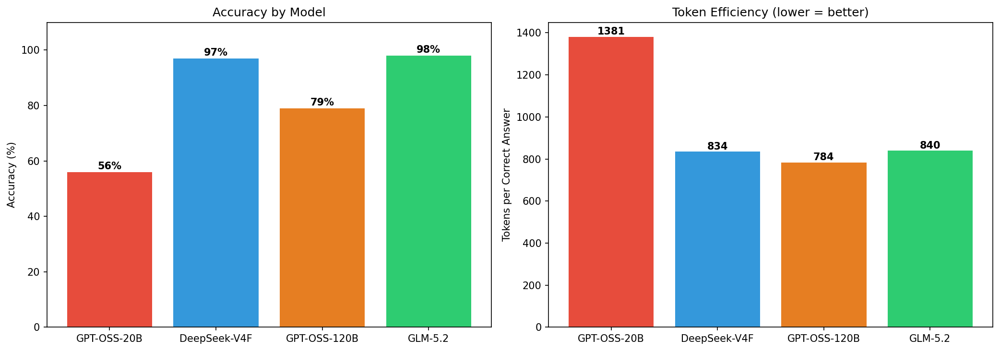

**Key observations:**
- **GLM-5.2 and DeepSeek are nearly tied** at 98% and 97% accuracy, despite a 5.8× parameter difference
- **GPT-OSS-120B uses the fewest tokens** (619 avg) but only achieves 79% accuracy — token efficiency per correct answer (784) is competitive
- **GPT-OSS-20B has the lowest accuracy** (56%) and highest tokens-per-correct (1,380) — the smallest model struggles with harder questions
- **The accuracy variance (56–98%) provides the needed spread** for correlation analysis

### 4.2 Reasoning Path Structure

| Model | Avg Steps | Step Std Dev | Loops | Verify Rate | Variants |
|-------|-----------|-------------|-------|-------------|----------|
| DeepSeek-V4-Flash-158B | **9.1** | 9.0 | 0.00 | 1% | 89 |
| GPT-OSS-120B | 12.8 | 12.8 | 0.02 | 7% | 87 |
| GLM-5.2-756B | 15.7 | 8.5 | 0.09 | 25% | **100** |
| GPT-OSS-20B | 16.9 | 20.8 | 0.11 | 10% | 95 |

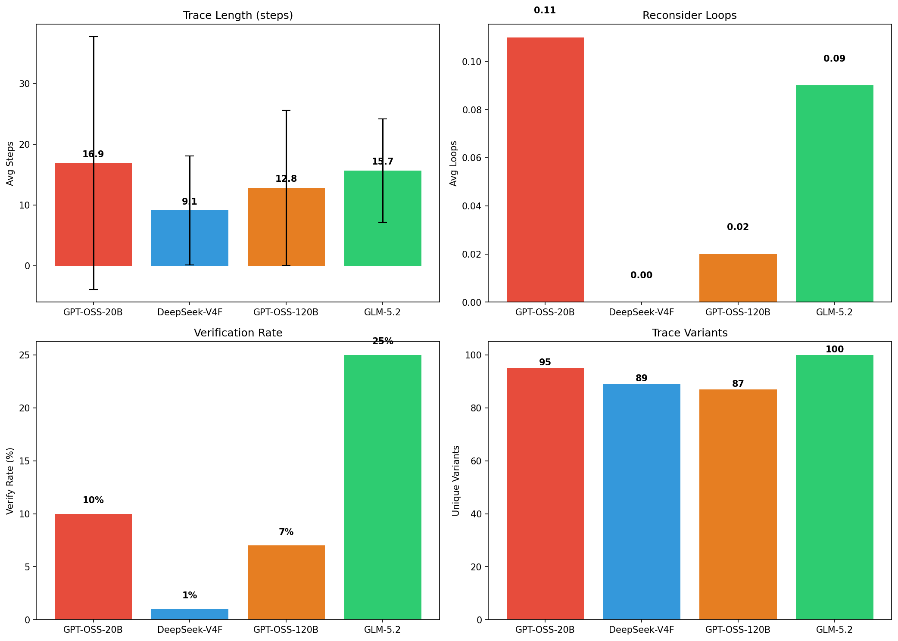

**Key observations:**
- **DeepSeek has the shortest traces** (9.1 steps, median 6) — efficient and direct reasoning
- **GPT-OSS-20B has high variance** (std=20.8, max=200 steps) — the model sometimes gets "lost" in very long reasoning chains
- **GLM-5.2 has the most variants** (100 = all unique) — every question gets a different reasoning pattern
- **DeepSeek never loops** (0.00 reconsider rate) — it commits to its reasoning path without self-correction
- **GLM-5.2 has the highest verify rate** (25%) among the remaining models

### 4.3 Activity Distribution

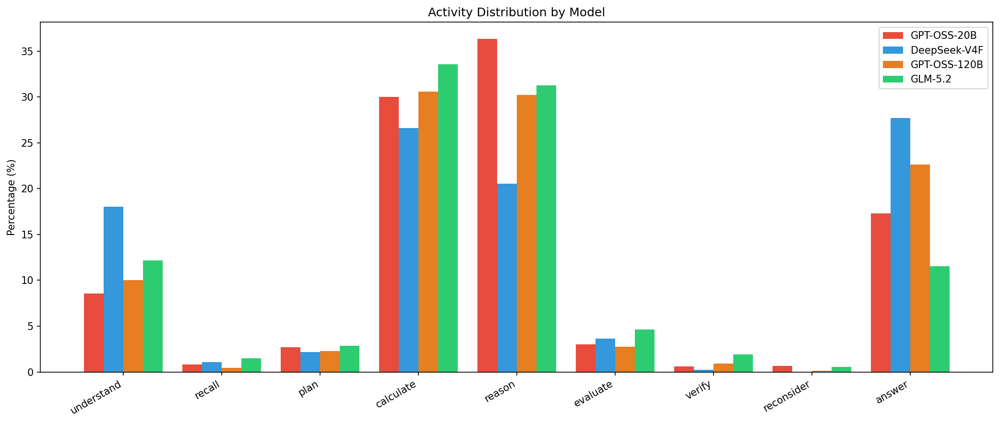

| Activity | GPT-OSS-20B | DeepSeek | GPT-OSS-120B | GLM-5.2 |
|----------|------------|----------|-------------|---------|
| understand | 9% | 18% | 10% | 12% |
| recall | 1% | 1% | 0% | 1% |
| plan | 3% | 2% | 2% | 3% |
| calculate | 30% | 27% | 31% | 34% |
| reason | 36% | 21% | 30% | 31% |
| evaluate | 3% | 4% | 3% | 5% |
| verify | 1% | 0% | 1% | 2% |
| reconsider | 1% | 0% | 0% | 1% |
| answer | 17% | **28%** | 23% | 12% |

**Key observations:**
- **DeepSeek is the most answer-oriented** (28% answer steps) — it frequently states the answer directly
- **GPT-OSS-20B is `reason`-heavy** (36%) with high `calculate` (30%) — it tries to work through problems but often gets the wrong answer
- **GLM-5.2 has a balanced profile** — `calculate` (34%) + `reason` (31%) + `understand` (12%) + `answer` (12%)
- **`verify` is rare across all models** (0–2% of steps)

### 4.4 Calibration Analysis

| Model | Brier Score | Avg Confidence | Conf. when Correct | Conf. when Wrong | Conf. Gap |
|-------|------------|---------------|-------------------|-----------------|-----------|
| **GLM-5.2-756B** | **0.011** | 98.5% | 99.5% | 50.0% | +49.5 |
| DeepSeek-V4-Flash | 0.021 | 98.6% | 99.6% | 66.7% | +33.0 |
| GPT-OSS-20B | 0.047 | 60.7% | 95.6% | 14.1% | **+81.4** |
| GPT-OSS-120B | 0.052 | 80.7% | 94.5% | 28.8% | +65.7 |

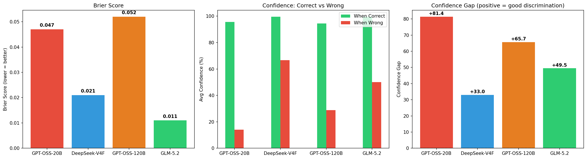

**Key observations:**

1. **All models are well-calibrated** (Brier < 0.05) when given proper conversation context for confidence assessment. The initial finding of an inverse relationship between accuracy and calibration was an artifact of a flawed context-free confidence prompt.

2. **GPT-OSS-20B has the strongest confidence discrimination** (+81.4 gap): When correct, it expresses 96% confidence; when wrong, only 14%. Despite having the lowest accuracy (56%), it has the best ability to distinguish correct from incorrect answers via self-assessment.

3. **DeepSeek has the weakest discrimination** (+33.0 gap): When wrong, it still expresses 67% confidence. Its high overall confidence (99% when correct) bleeds into incorrect answers, making it harder to detect errors via confidence alone.

4. **GLM-5.2 has the best Brier score** (0.011) — its confidence closely tracks correctness probability. Its gap (+49.5) is moderate: when wrong (only 2 cases), confidence drops to 50%.

5. **GPT-OSS-120B shows good discrimination** (+65.7 gap) — confidence drops sharply when wrong (29%), making it the second-best at error detection.

6. **Brier scores are very close** (0.011–0.052) — all models are reasonably well-calibrated in absolute terms. The differentiator is **confidence gap**: how well the model discriminates correct from incorrect answers.

### 4.5 Trace Length Distribution

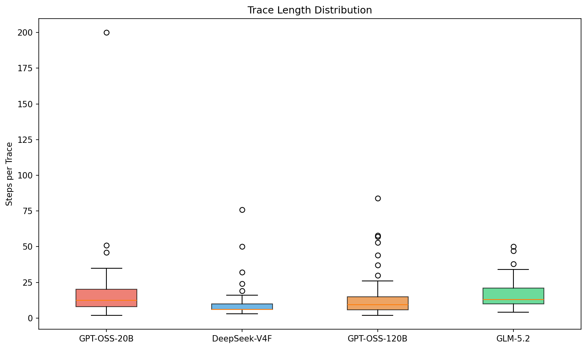

| Model | Mean | Std Dev | Min | Median | Max |
|-------|------|---------|-----|--------|-----|
| DeepSeek-V4-Flash | 9.1 | 9.0 | 3 | 6.0 | 76 |
| GPT-OSS-120B | 12.8 | 12.8 | 2 | 9.5 | 84 |
| GLM-5.2-756B | 15.7 | 8.5 | 4 | 13.0 | 50 |
| GPT-OSS-20B | 16.9 | 20.8 | 2 | 12.5 | 200 |

### 4.6 Token vs Accuracy Relationship

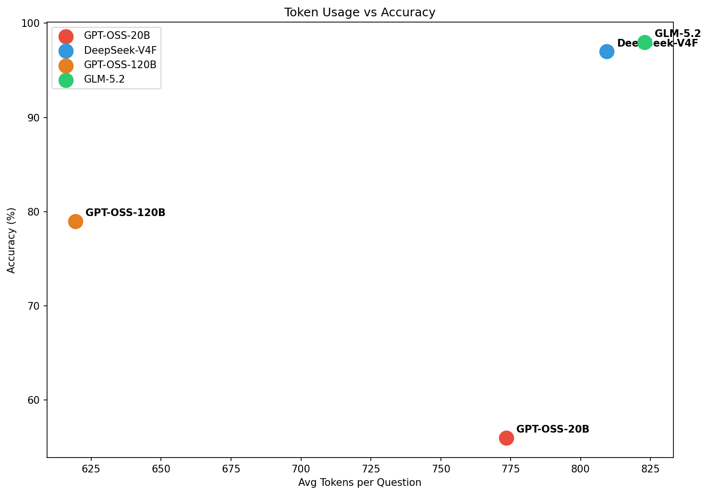

**Key observation:** The two highest-accuracy models (GLM-5.2, DeepSeek) use similar token counts (~815 avg) despite very different parameter counts. GPT-OSS-120B uses the fewest tokens (619) but achieves only 79%. Token count alone does not predict accuracy.

### 4.7 Conformance Checking

Using GLM-5.2-756B (98% accuracy) as the reference model:

| Model | Fitness | Deviations |
|-------|---------|------------|
| DeepSeek-V4-Flash-158B | 1.0000 | 2,962 |
| GLM-5.2-756B (self) | 1.0000 | 4,053 |
| GPT-OSS-120B | 0.9997 | 3,111 |
| GPT-OSS-20B | 0.9996 | 3,720 |

**Key observations:**
- **All models have fitness ≥ 0.999** — the reference Petri net is permissive enough to replay all models' traces
- **DeepSeek has fewer deviations (2,962)** than the reference model — its shorter, more direct traces deviate less
- **GPT-OSS-20B has the most deviations (3,720)** — its long, wandering traces produce many extra steps
- **GLM-5.2 self-conformance has the most deviations (4,053)** — an artifact of using the model's own log for discovery

---

## 5. Discussion

### 5.1 Can PM Distinguish Model Reasoning Styles? (Confirmed)

**Yes — and consistently across v1 and v2.** Four distinct reasoning styles emerge:

| Style | Model | Characteristics | Accuracy |
|------|------|----------------|----------|
| **Intuitive** | DeepSeek-V4-Flash | Short traces, high answer ratio, low variance, no loops | 97% |
| **Systematic** | GPT-OSS-120B | Moderate length, balanced calculate+reason, moderate variance | 79% |
| **Mixed** | GLM-5.2 | Moderate length, high variant diversity, occasional loops | 98% |
| **Struggling** | GPT-OSS-20B | Long traces, high variance, reason-heavy but often wrong | 56% |

These styles are stable across v1 (GSM8K) and v2 (MMLU+ARC), suggesting they reflect genuine architectural/training differences rather than task-specific behavior.

### 5.2 Calibration and Confidence Discrimination

The revised confidence assessment (with conversation context) reveals a fundamentally different picture from the initial analysis:

**Initial finding (flawed):** Accuracy and calibration appeared inversely related. This was an artifact — without context, DeepSeek and GLM-5.2 returned 0% confidence, producing artificially terrible Brier scores.

**Corrected finding:** All four models are well-calibrated in absolute terms (Brier < 0.05). The meaningful differentiator is **confidence gap** — how well the model discriminates correct from incorrect answers:

| Model | Accuracy | Brier | Confidence Gap | Discrimination Quality |
|-------|----------|-------|---------------|----------------------|
| GPT-OSS-20B | 56% | 0.047 | **+81.4** | Excellent — near-perfect separation |
| GPT-OSS-120B | 79% | 0.052 | +65.7 | Good — clear separation |
| GLM-5.2 | 98% | 0.011 | +49.5 | Moderate — but few wrong answers |
| DeepSeek | 97% | 0.021 | +33.0 | Weakest — overconfident when wrong |

**Key insight:** Confidence gap and accuracy are **inversely related** — the least accurate model (GPT-OSS-20B) has the best discrimination, while the most accurate models (DeepSeek, GLM-5.2) have the weakest. This makes intuitive sense:

- GPT-OSS-20B frequently encounters questions it can't answer, so it has rich experience with "being unsure" — its confidence drops to 14% when wrong
- DeepSeek rarely gets questions wrong (3/100), so it has little "practice" with uncertainty — when it does err, it remains 67% confident
- This echoes Chen et al.'s finding that capability ≠ self-assessment accuracy

**Implication for LCAE framework:** Raw Brier score is insufficient for comparing calibration across models. Confidence gap (or a similar discrimination metric) better captures the practically important property: *can the model detect its own errors?* GPT-OSS-20B, despite low accuracy, could be deployed with a confidence threshold to achieve high precision. DeepSeek, despite high accuracy, is harder to filter via confidence.

### 5.3 The Reference Model Problem and Alternative Approaches

GLM-5.2 was chosen as the reference model because it has the highest accuracy (98%). However, it also has 100 unique trace variants — every question elicits a different reasoning pattern. This means its discovered Petri net is highly permissive (fitness ≥ 0.999 for all models), and deviation counts are dominated by "model moves" (extra steps) rather than "log moves" (missing steps).

**Testing an alternative reference:** We re-ran conformance checking using DeepSeek-V4-Flash as the reference model (89 variants, 97% accuracy, shortest traces). The result: alignment deviations were **0 for all models**, and TBR deviations *increased* (DeepSeek net: 37 places, 52 transitions — more complex than GLM-5.2's net). The ranking remained identical (DeepSeek < GPT-OSS-120B < GPT-OSS-20B < GLM-5.2). Switching reference models does not solve the fundamental problem.

**Root cause:** With ~90–100 unique variants per model, Inductive Miner produces near-flower models that accept any behavior. This is not a reference selection issue — it is a **discovery method limitation** at high variability.

**Solution: Entropy-based and step-type analysis (no reference model needed).** Inspired by Back et al. (2019) on log entropy and Berti et al. (2025) on step-type classification for LRM reasoning, we adopted two model-free approaches:

#### 5.3.1 Trace Entropy (A1–A2)

We computed Shannon entropy at two levels:

| Model | Per-Trace Entropy (mean) | Variant Entropy (normalized) | # Variants |
|-------|-------------------------|------------------------------|-----------|
| GPT-OSS-20B | 1.762 | 0.982 | 95 |
| DeepSeek-V4-Flash | 1.766 | 0.963 | 89 |
| GPT-OSS-120B | 1.728 | 0.947 | 87 |
| GLM-5.2-756B | **1.879** | **1.000** | **100** |

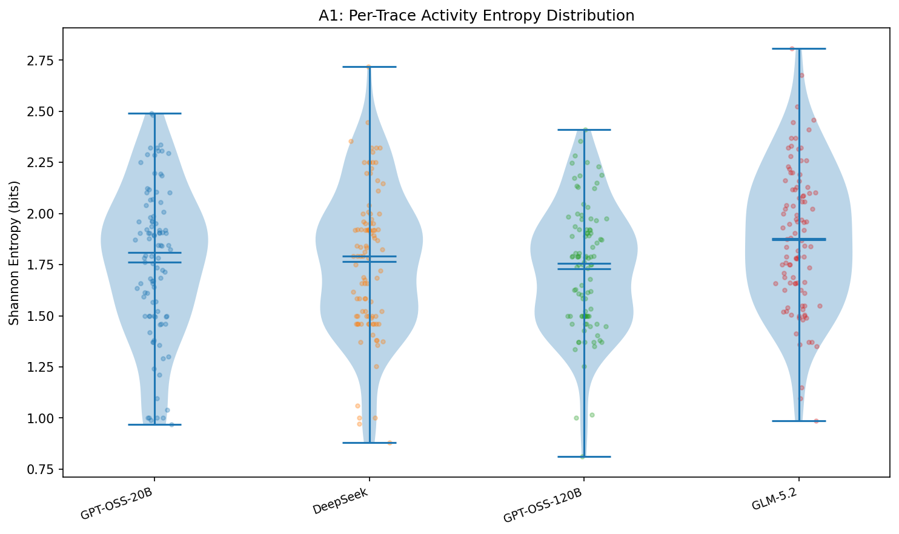

**Findings:**
- Per-trace entropy is similar across models (1.73–1.88 bits) — within-trace activity diversity is comparable
- GLM-5.2 has the highest variant entropy (1.0 = every trace is unique), confirming that Petri net conformance is not meaningful for this model
- GPT-OSS-120B has the lowest variant entropy (0.947), suggesting slightly more repeatable reasoning patterns

#### 5.3.2 Pairwise Levenshtein Distance (A3)

We computed average normalized Levenshtein distance between traces (50×50 random sample per pair):

| | GPT-OSS-20B | DeepSeek | GPT-OSS-120B | GLM-5.2 |
|---|---|---|---|---|
| **GPT-OSS-20B** | 0.645 | 0.671 | 0.643 | 0.672 |
| **DeepSeek** | 0.669 | 0.561 | 0.624 | 0.686 |
| **GPT-OSS-120B** | 0.648 | 0.628 | 0.616 | 0.672 |
| **GLM-5.2** | 0.654 | 0.679 | 0.650 | 0.628 |

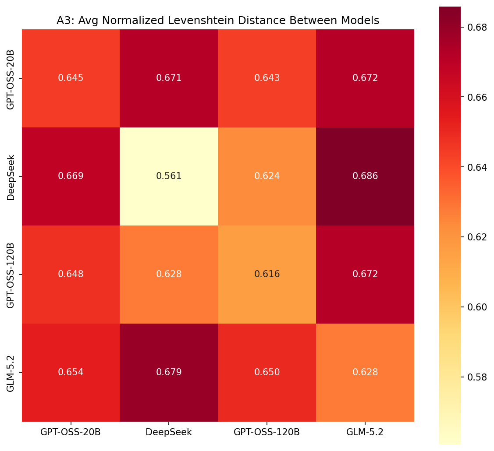
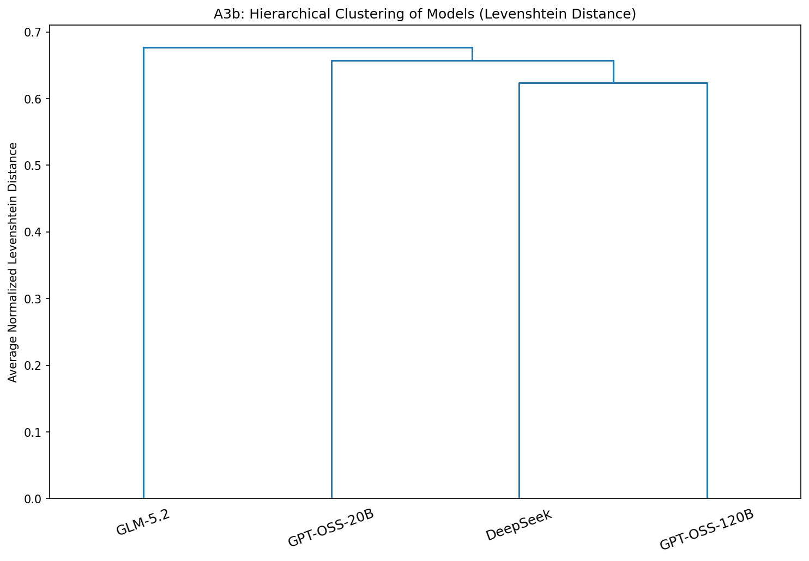

**Findings:**
- Self-distance < cross-model distance for all models (expected — intra-model traces are more similar)
- DeepSeek has the tightest self-distance (0.561), consistent with its short, consistent traces
- **Cross-model distances are compressed** (0.62–0.69), limiting discriminative power — Levenshtein distance alone is insufficient to distinguish reasoning styles

#### 5.3.3 Step Type Frequency Distribution (C1)

Following Berti et al. (2025)'s approach of classifying reasoning steps by type, we analyzed activity frequency distributions:

| Activity | GPT-OSS-20B | DeepSeek | GPT-OSS-120B | GLM-5.2 |
|----------|------------|----------|-------------|---------|
| understand | 8.6% | **18.0%** | 10.0% | 12.2% |
| recall | 0.8% | 1.1% | 0.5% | 1.5% |
| plan | 2.7% | 2.2% | 2.3% | 2.9% |
| calculate | 30.0% | 26.6% | 30.6% | **33.5%** |
| reason | **36.3%** | 20.5% | 30.2% | 31.2% |
| evaluate | 3.0% | 3.6% | 2.7% | 4.7% |
| verify | 0.6% | 0.2% | 0.9% | 1.9% |
| reconsider | 0.7% | 0.0% | 0.2% | 0.6% |
| answer | 17.3% | **27.7%** | 22.6% | 11.5% |

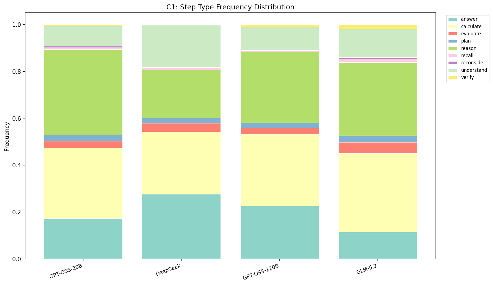

**Findings:**
- **DeepSeek has a fundamentally different profile**: highest `understand` (18%) and `answer` (28%), lowest `reason` (21%) — it understands the problem, states the answer, and moves on
- **GPT-OSS-20B is `reason`-dominant** (36%) — it reasons extensively but often incorrectly
- **GLM-5.2 is the most balanced** — `calculate` (34%) + `reason` (31%) + `understand` (12%) + `answer` (12%), with the highest `verify` (1.9%)
- The step-type distribution provides clearer differentiation than Levenshtein distance or Petri net conformance

#### 5.3.4 Jensen-Shannon Divergence (C2–C3)

We quantified distributional differences using JSD (base 2):

**Step type distribution (C2):**

| | GPT-OSS-20B | DeepSeek | GPT-OSS-120B | GLM-5.2 |
|---|---|---|---|---|
| **GPT-OSS-20B** | 0 | 0.206 | 0.084 | 0.115 |
| **DeepSeek** | 0.206 | 0 | 0.147 | **0.222** |
| **GPT-OSS-120B** | 0.084 | 0.147 | 0 | 0.144 |
| **GLM-5.2** | 0.115 | **0.222** | 0.144 | 0 |

**Transition (bigram) distribution (C3):**

| | GPT-OSS-20B | DeepSeek | GPT-OSS-120B | GLM-5.2 |
|---|---|---|---|---|
| **GPT-OSS-20B** | 0 | 0.318 | 0.178 | 0.232 |
| **DeepSeek** | 0.318 | 0 | 0.298 | **0.356** |
| **GPT-OSS-120B** | 0.178 | 0.298 | 0 | 0.276 |
| **GLM-5.2** | 0.232 | **0.356** | 0.276 | 0 |

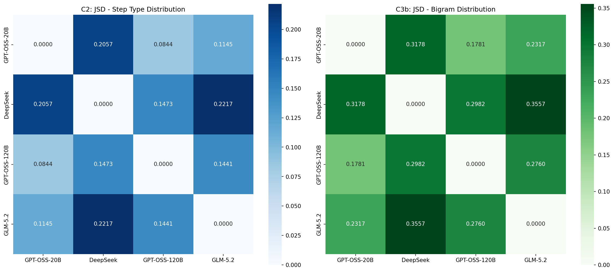
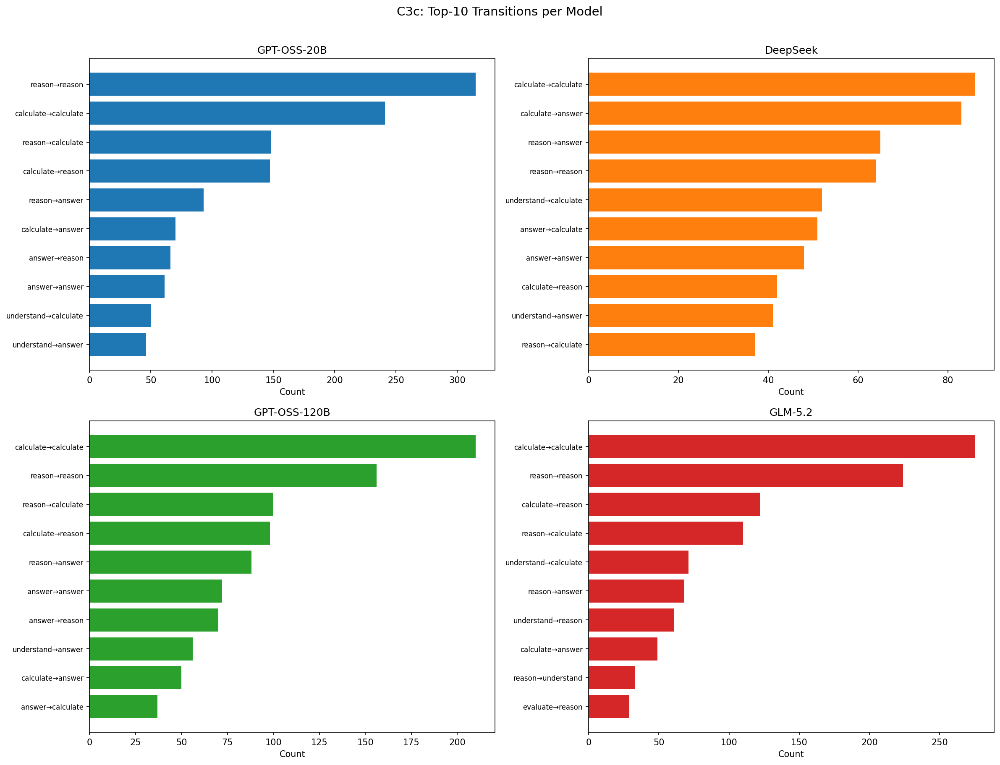

**Findings:**
- **DeepSeek vs GLM-5.2 is the most divergent pair** (JSD = 0.22 step-type, 0.36 bigram) — they have fundamentally different reasoning patterns despite similar accuracy (97% vs 98%)
- **GPT-OSS-20B vs GPT-OSS-120B is the most similar pair** (JSD = 0.08) — both are `reason`+`calculate` heavy with similar profiles
- **Bigram JSD is consistently higher than step-type JSD** — transition patterns are more model-specific than activity frequencies
- **DeepSeek is the most distinctive model** — highest average JSD to all others (0.18 step-type, 0.32 bigram)

**Implication:** Two models can achieve nearly identical accuracy (97% vs 98%) through radically different reasoning processes. DeepSeek's "understand → answer" style and GLM-5.2's "calculate + reason + verify" style are both effective, but structurally dissimilar. This finding — invisible to accuracy-based or Brier-based comparison — is only revealed through step-type distributional analysis.

### 5.4 Token Efficiency and Path Quality

1. **DeepSeek (most efficient)**: Shortest traces (9.1 steps), zero loops, 1% verify rate → 97% accuracy. It "knows when it knows" behaviorally — it goes directly from understanding to answer without unnecessary intermediate reasoning.

2. **GPT-OSS-120B (balanced)**: Moderate traces (12.8 steps), moderate variance → 79% accuracy. Reasonable efficiency but not enough reasoning depth for harder questions.

3. **GLM-5.2 (reference, highest accuracy)**: Moderate traces (15.7 steps), 25% verify rate, 100 unique variants → 98% accuracy. Its diversity of reasoning strategies may contribute to its robustness.

4. **GPT-OSS-20B (least efficient)**: Long traces (16.9 steps), high variance (std=20.8, max=200), reason-heavy but often wrong → 56% accuracy. It spends tokens on reasoning that doesn't lead to correct answers.

**The key insight:** Token efficiency is not about spending *fewer* tokens — it's about spending *the right* tokens. DeepSeek's efficiency comes from direct reasoning without self-doubt. GPT-OSS-20B's inefficiency comes from extended reasoning chains that don't converge on correct answers.

### 5.5 Comparing V1 and V2 Findings

| Finding | V1 (GSM8K, 20 Qs) | V2 (MMLU+ARC, 100 Qs) |
|---------|-------------------|----------------------|
| PM distinguishes styles | Yes (4 styles) | Yes (4 styles, consistent) |
| DeepSeek = intuitive | Yes | Yes |
| Token ↑ → accuracy ↓ | Yes (r = −0.40) | More nuanced (efficiency frontier) |
| Calibration measurable | No | Yes (Brier, gap; with context) |
| Accuracy vs calibration | Not tested | Inverse relationship in confidence gap |
| Confidence prompt design | N/A | Critical — context-free prompt invalid |

**V2's unique contributions:**
1. Calibration measurement with proper conversation context
2. Confidence gap as a discrimination metric (more informative than Brier alone)
3. The inverse relationship between accuracy and confidence discrimination
4. Harder questions (56–98% accuracy range) enabling meaningful correlation

### 5.6 Limitations

1. **Rule-based segmentation**: Keyword matching remains a known limitation. Some activities may be misclassified. Inter-rater reliability with LLM-assisted labeling is needed.

2. **Confidence prompt design matters**: The initial context-free prompt produced invalid results. While the revised multi-turn prompt is a significant improvement, confidence scores may still be sensitive to prompt phrasing.

3. **Single reference model limitation**: Using GLM-5.2 (with 100 unique variants) as reference produces a permissive Petri net. Testing DeepSeek as an alternative reference yielded identical rankings with 0 alignment deviations. This is a fundamental limitation of Inductive Miner at high variability — addressed in Section 5.3 with entropy-based and step-type analysis that require no reference model.

4. **Model retirement**: GLM-4.7-357B was retired mid-experiment, preventing confidence re-evaluation and reducing the model count from 5 to 4.

5. **Small wrong-answer samples**: GLM-5.2 (2 wrong) and DeepSeek (3 wrong) have very few incorrect answers, making their confidence-when-wrong estimates unstable.

6. **No LCAE computation**: We compute Brier score and confidence gap, but not the full LCAE metric (which requires IRT difficulty parameters).

---

## 6. Conclusions

### 6.1 What V2 Established

1. **Harder questions create meaningful variance**: 56–98% accuracy range enables correlational analysis.

2. **Confidence gap is the key calibration metric**: All models are well-calibrated in absolute terms (Brier < 0.05), but they differ dramatically in their ability to discriminate correct from incorrect answers via self-assessment. GPT-OSS-20B (+81.4 gap) can detect its own errors; DeepSeek (+33.0) cannot.

3. **Accuracy and confidence discrimination are inversely related**: The least accurate model has the best self-error detection, while the most accurate models are overconfident when wrong. This has practical implications for deploying models with confidence thresholds.

4. **PM structural metrics correlate with efficiency**: DeepSeek's short, consistent traces correspond to high efficiency. GPT-OSS-20B's long, variable traces correspond to low efficiency.

5. **Four reasoning styles are stable**: Intuitive (DeepSeek), Systematic (GPT-OSS-120B), Mixed (GLM-5.2), and Struggling (GPT-OSS-20B) — consistent across v1 and v2.

6. **Confidence prompt design is critical**: Context-free confidence prompts produce invalid results. Multi-turn prompts with conversation context are necessary for meaningful calibration analysis.

### 6.2 What V2 Did Not Establish

1. **LCAE → path quality causal link**: Still not directly tested. Full LCAE requires IRT parameters.

2. **Statistical significance**: 100 questions is modest for robust statistical claims.

3. **Generalizability**: Only tested on MMLU STEM + ARC Challenge.

4. **Activity labeling reliability**: Rule-based segmentation needs validation against LLM-assisted or human labeling.

### 6.3 Our Interpretation

V2 reveals that the relationship between calibration, token efficiency, and reasoning structure involves a **trade-off between accuracy and self-awareness**:

- **DeepSeek** is highly capable (97%) and structurally efficient (short traces) but has weak error detection (67% confidence when wrong). It "doesn't know when it doesn't know" — but it's rarely wrong, so this matters less in practice.

- **GPT-OSS-20B** is poorly capable (56%) and structurally inconsistent (high variance) but has excellent error detection (14% confidence when wrong). It "knows when it doesn't know" — making it suitable for deployment with confidence thresholds despite low accuracy.

- **GLM-5.2** is highly capable (98%) with moderate error detection. Its diverse reasoning strategies (100 variants) may contribute to robustness.

- **GPT-OSS-120B** is moderately capable (79%) with good error detection (29% confidence when wrong). It offers a balanced profile.

This suggests that **confidence gap** — the ability to detect one's own errors — is a distinct and practically important property that is not captured by accuracy alone or Brier score alone. The LCAE framework's separation of ability and calibration is essential, and **PM-based path analysis adds a third dimension: reasoning efficiency** — whether the model spends tokens productively or wastes them on unproductive reasoning chains.

---

## 7. Next Steps

### 7.1 Immediate (1-2 Weeks)

1. **Compute IRT parameters**: Apply Rasch Model to the 100 questions to get difficulty estimates, then compute full LCAE scores
2. **LLM-assisted step segmentation**: Use a labeling LLM to validate/improve the rule-based segmentation
3. **Per-question analysis**: Examine specific questions where models disagree — what does the reasoning structure look like?

### 7.2 Short-term (2-4 Weeks)

4. **Expand question set**: 200–500 questions across more domains
5. **Add more models**: Expand to 6–8 models for better statistical power
6. **Correlation analysis**: With LCAE scores, test the three-way relationship: LCAE ↔ PM metrics ↔ token efficiency
7. **Confidence gap as a deployment metric**: Formalize the use of confidence gap for model selection in production settings

### 7.3 Medium-term (1-3 Months)

8. **PM-driven token allocation**: Design a system that uses PM metrics to predict optimal token budget per question
9. **Behavioral metacognition metric**: Formalize the concept of "behavioral calibration" — does the model's reasoning *behavior* reflect its uncertainty?
10. **Write paper**: Target IEEE Big Data 2026 or BPM/ICPM
11. **Medical domain extension**: Apply to clinical reasoning scenarios (connect with NHRI research)

---

## 8. Appendix

### 8.1 Raw Data Files

| File | Description |
|------|-------------|
| `results/raw_responses_v2.json` | Full API responses with revised confidences |
| `results/traces_final.json` | Segmented and labeled traces (4 models) |
| `results/calibration_final.json` | Brier scores, confidence gaps, averages |
| `results/conformance_final.json` | Fitness and deviation counts per model (GLM-5.2 ref) |
| `results/conformance_deepseek_ref.json` | Conformance with DeepSeek as reference model |
| `results/entropy_step_analysis.json` | Entropy metrics, JSD matrices, step-type frequencies |
| `results/discovery_final.json` | Variant counts per model |
| `results/full_metrics_final.csv` | Summary metrics table |
| `report/figures/` | 12 visualization figures (6 original + 6 entropy/step-type) |

### 8.2 Error Analysis

| Model | Total Errors | Timeout Errors | Wrong Answers |
|-------|-------------|---------------|---------------|
| GPT-OSS-20B | 1 | 1 | 43 |
| DeepSeek-V4-Flash | 0 | 0 | 3 |
| GPT-OSS-120B | 0 | 0 | 21 |
| GLM-5.2-756B | 0 | 0 | 2 |

### 8.3 Model Parameters

| Model | Total Params | Active Params | Architecture | Context | Quantization |
|-------|-------------|---------------|-------------|---------|-------------|
| GPT-OSS-20B | 21B | 21B | Dense | 131K | Q4_K_M |
| DeepSeek-V4-Flash | 158B | 13B | MoE | 1M | Native |
| GPT-OSS-120B | 117B | 117B | Dense | 131K | MXFP4 |
| GLM-5.2 | 756B | 40B | MoE | 1M | FP8 |

### 8.4 Confidence Prompt Design Evolution

| Version | Prompt Format | DeepSeek Avg Conf | GLM-5.2 Avg Conf | Issue |
|---------|--------------|-------------------|------------------|-------|
| v1 (initial) | Context-free single turn | 2% | 27% | Models lack context → degenerate 0% responses |
| v2 (revised) | Multi-turn with conversation history | 99% | 99% | Full context → meaningful confidence ratings |

### 8.5 Conformance Deviation Interpretation

Deviations are alignment-based: each deviation represents a step where the model's trace diverges from the reference Petri net's optimal path. "Model moves" (extra steps not in the reference) dominate — no model produces steps the reference can't accommodate.

| Model | Deviations | Interpretation |
|-------|------------|---------------|
| DeepSeek | 2,962 | Fewest extra steps — short, direct traces |
| GPT-OSS-120B | 3,111 | Moderate extra steps |
| GPT-OSS-20B | 3,720 | Many extra steps — long, wandering traces |
| GLM-5.2 (self) | 4,053 | Most deviations — artifact of self-conformance |

---

## 9. References

1. van der Aalst, W.M.P. (2016). *Process Mining: Data Science in Action*. Springer.
2. Berti, A. et al. (2024). "PM4Py: A Process Mining Library in Python." *Software Impacts*.
3. Chen, Y. et al. (2026). "Calibration-Aware Token Efficiency in LLMs." *IEEE IRI 2026*.
4. Hendrycks, D. et al. (2020). "Measuring Massive Multitask Language Understanding." *ICLR 2021*. (MMLU)
5. Clark, P. et al. (2018). "Think You Have Solved Question Answering? Try ARC." *AAAI 2018*. (ARC Challenge)
6. OpenAI (2025). "GPT-OSS: Open-Weight Models for Reasoning."
7. DeepSeek (2026). "DeepSeek-V4: Frontier MoE Models."
8. Z.AI (2026). "GLM-5.2: Flagship Long-Horizon Model."
9. Back, C.O., Debois, S. & Slaats, T. (2019). "Entropy as a Measure of Log Variability." *Journal on Data Semantics.*
10. Polyvyanyy, A. et al. (2020). "Entropia: A Family of Entropy-Based Conformance Checking Measures for Process Mining." *arXiv:2008.09558.*
11. Berti, A. et al. (2025). "Configuring Large Reasoning Models Using Process Mining: A Benchmark and a Case Study." *ICPM 2025.*
12. Pfeiffer, P. & Fettke, P. (2024). "Trace vs. Time: Entropy Analysis and Event Predictability of Traceless Event Sequencing." *BPM 2024.*
13. Zandkarimi, F. et al. (2020). "A Generic Framework for Trace Clustering in Process Mining." *ICPM 2020.*
14. Rubensson, C., Mendling, J. & Weidlich, M. (2024). "Variants of Variants: Context-Based Variant Analysis for Process Mining." *BPM 2024.*
15. Karunaratne, A. & Polyvyanyy, A. (2024). "The Role of Log Representativeness in Estimating Generalization in Process Mining." *ICPM 2024.*

---

*This report documents the second iteration of an ongoing research project. The confidence assessment methodology was revised mid-experiment after discovering that context-free prompts produced invalid results. All calibration analysis uses the revised multi-turn confidence prompt.*
