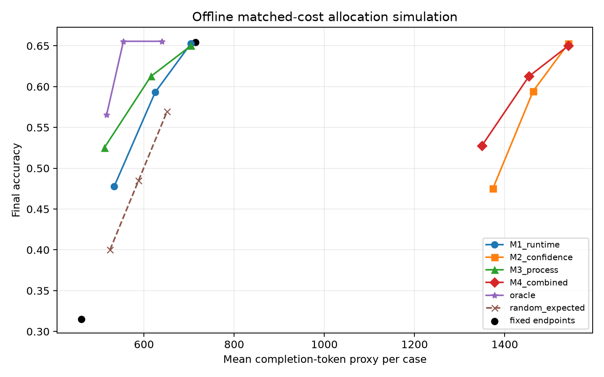

# Process-prefix value PoC report

> Offline predictive-feasibility analysis. Phase 3 low/high outputs were independent calls.

## Dataset

- Records: **720**
- Positive benefit prevalence: **34.0%**
- Budget comparison: **512 → 1024**

## Grouped out-of-fold prediction

| Feature set | PR-AUC | AUROC | Brier | Log loss |
|---|---:|---:|---:|---:|
| M0_context | 0.367 | 0.526 | 0.236 | 0.673 |
| M1_runtime | 0.616 | 0.817 | 0.170 | 0.510 |
| M2_confidence | 0.614 | 0.819 | 0.169 | 0.509 |
| M3_process | 0.795 | 0.875 | 0.134 | 0.464 |
| M4_combined | 0.796 | 0.877 | 0.134 | 0.465 |

## Primary incremental-value contrast

M4 combined minus M2 confidence PR-AUC: **0.182**, clustered bootstrap 95% CI [0.064, 0.276].

## Matched-cost allocation

| Upgrade rate | Policy | Accuracy | Mean token proxy |
|---:|---|---:|---:|
| 25% | random_expected | 40.0% | 524.6 |
| 25% | M2_confidence | 47.5% | 1373.6 |
| 25% | M3_process | 52.5% | 512.0 |
| 25% | M4_combined | 52.8% | 1349.5 |
| 25% | oracle | 56.5% | 517.2 |
| 50% | random_expected | 48.5% | 587.9 |
| 50% | M2_confidence | 59.4% | 1463.0 |
| 50% | M3_process | 61.3% | 615.2 |
| 50% | M4_combined | 61.3% | 1453.5 |
| 50% | oracle | 65.6% | 554.5 |
| 75% | random_expected | 56.9% | 651.1 |
| 75% | M2_confidence | 65.3% | 1541.0 |
| 75% | M3_process | 65.0% | 703.9 |
| 75% | M4_combined | 65.0% | 1540.8 |
| 75% | oracle | 65.6% | 639.6 |

## Required interpretation

- M4 must be compared with the strongest non-process baseline, not with random alone.
- Confidence-call prompt and completion tokens are charged to M2 and M4.
- A positive offline result justifies an interventional continuation pilot; it does not establish a causal online allocation benefit.
- If answer presence alone explains the target, process mining has not shown incremental value.
