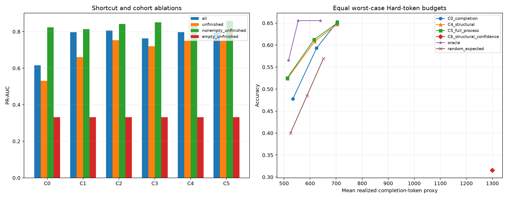

# Stage 1.5：Process signal robustness report

> This analysis removes conclusion shortcuts, conditions on unfinished cases, and uses equal worst-case Hard-token budgets.

## Cohorts

| Cohort | n | Questions | Benefit rate | Empty trace rate |
|---|---:|---:|---:|---:|
| all | 720 | 60 | 34.0% | 39.9% |
| unfinished | 483 | 59 | 49.9% | 59.4% |
| nonempty_unfinished | 196 | 47 | 87.2% | 0.0% |
| empty_unfinished | 287 | 46 | 24.4% | 100.0% |

## all: grouped out-of-fold metrics

| Profile | PR-AUC | AUROC | Brier | Log loss |
|---|---:|---:|---:|---:|
| C0_completion | 0.616 | 0.817 | 0.170 | 0.510 |
| C1_last_activity | 0.797 | 0.889 | 0.125 | 0.408 |
| C2_activity_counts | 0.806 | 0.889 | 0.126 | 0.406 |
| C3_dfg_only | 0.763 | 0.844 | 0.147 | 0.644 |
| C4_structural | 0.797 | 0.865 | 0.135 | 0.543 |
| C5_full_process | 0.795 | 0.875 | 0.134 | 0.464 |
| C6_structural_confidence | 0.797 | 0.866 | 0.135 | 0.546 |

C4 structural minus C0 completion PR-AUC: **0.181**, clustered 95% CI [0.058, 0.283].

## unfinished: grouped out-of-fold metrics

| Profile | PR-AUC | AUROC | Brier | Log loss |
|---|---:|---:|---:|---:|
| C0_completion | 0.531 | 0.606 | 0.281 | 0.911 |
| C1_last_activity | 0.661 | 0.736 | 0.219 | 0.754 |
| C2_activity_counts | 0.753 | 0.752 | 0.221 | 0.755 |
| C3_dfg_only | 0.720 | 0.711 | 0.240 | 0.985 |
| C4_structural | 0.750 | 0.731 | 0.235 | 0.958 |
| C5_full_process | 0.751 | 0.732 | 0.237 | 0.849 |
| C6_structural_confidence | 0.751 | 0.735 | 0.233 | 0.960 |

C4 structural minus C0 completion PR-AUC: **0.219**, clustered 95% CI [0.113, 0.288].

## nonempty_unfinished: grouped out-of-fold metrics

| Profile | PR-AUC | AUROC | Brier | Log loss |
|---|---:|---:|---:|---:|
| C0_completion | 0.823 | 0.445 | 0.167 | 0.781 |
| C1_last_activity | 0.814 | 0.415 | 0.179 | 0.858 |
| C2_activity_counts | 0.842 | 0.441 | 0.168 | 0.893 |
| C3_dfg_only | 0.851 | 0.498 | 0.188 | 1.038 |
| C4_structural | 0.844 | 0.447 | 0.199 | 1.446 |
| C5_full_process | 0.858 | 0.463 | 0.199 | 1.154 |
| C6_structural_confidence | 0.847 | 0.457 | 0.196 | 1.417 |

C4 structural minus C0 completion PR-AUC: **0.021**, clustered 95% CI [-0.048, 0.059].

## empty_unfinished: grouped out-of-fold metrics

| Profile | PR-AUC | AUROC | Brier | Log loss |
|---|---:|---:|---:|---:|
| C0_completion | 0.332 | 0.603 | 0.205 | 0.640 |
| C1_last_activity | 0.332 | 0.603 | 0.205 | 0.640 |
| C2_activity_counts | 0.332 | 0.603 | 0.205 | 0.640 |
| C3_dfg_only | 0.332 | 0.603 | 0.205 | 0.640 |
| C4_structural | 0.332 | 0.603 | 0.205 | 0.640 |
| C5_full_process | 0.332 | 0.603 | 0.205 | 0.640 |
| C6_structural_confidence | 0.352 | 0.611 | 0.201 | 0.634 |

C4 structural minus C0 completion PR-AUC: **0.000**, clustered 95% CI [0.000, 0.000].

## Equal Hard-token budget policy simulation

| Nominal extra budget | Policy | Accuracy | Realized token proxy | Upgraded | Feasible |
|---:|---|---:|---:|---:|---|
| 25% | random_expected | 40.0% | 524.6 | 180 | True |
| 25% | C0_completion | 47.8% | 534.0 | 180 | True |
| 25% | C4_structural | 52.4% | 512.8 | 180 | True |
| 25% | C5_full_process | 52.5% | 512.0 | 180 | True |
| 25% | C6_structural_confidence | 31.5% | 1299.6 | 0 | False |
| 25% | oracle | 56.5% | 517.2 | 180 | True |
| 50% | random_expected | 48.5% | 587.9 | 360 | True |
| 50% | C0_completion | 59.3% | 624.9 | 360 | True |
| 50% | C4_structural | 60.8% | 617.6 | 360 | True |
| 50% | C5_full_process | 61.3% | 615.2 | 360 | True |
| 50% | C6_structural_confidence | 31.5% | 1299.6 | 0 | False |
| 50% | oracle | 65.6% | 554.5 | 360 | True |
| 75% | random_expected | 56.9% | 651.1 | 540 | True |
| 75% | C0_completion | 65.3% | 704.2 | 540 | True |
| 75% | C4_structural | 64.7% | 703.7 | 540 | True |
| 75% | C5_full_process | 65.0% | 703.9 | 540 | True |
| 75% | C6_structural_confidence | 31.5% | 1299.6 | 0 | False |
| 75% | oracle | 65.6% | 639.6 | 540 | True |

## Pre-registered interpretation

- Primary cohort: `unfinished` (`low_has_parsed_answer=0`).
- Primary contrast: C4 structural vs C0 completion.
- C4 excludes every `conclude` event and answer-equivalent process feature.
- If C4 does not improve the unfinished cohort, Stage 1 supports progress/completion detection but not a structural process-mining claim.
- Empty and non-empty trace results must be reported separately.
- Confidence is retained as an ablation and pays its complete prompt+completion cost.
- The low/high responses remain independent calls; no causal continuation claim is allowed.
