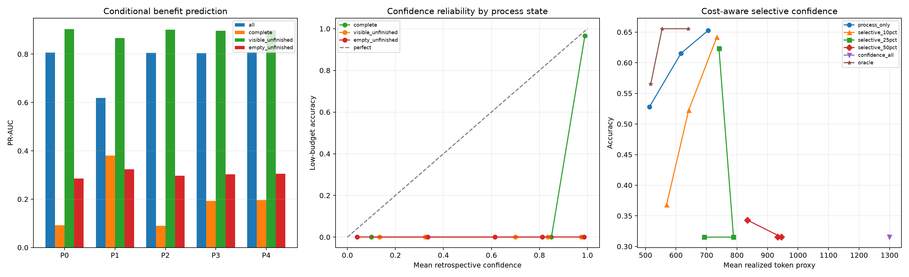

# Stage 1.6：Process-conditioned confidence report

> Offline diagnosis only. Low/high Phase 3 outputs are independent calls, not resumed generations.

## Data and states

- Records: **720**
- Unique questions: **60**
- Budget comparison: **512 → 1024**
- Missing confidence: **6**

| State | n | Low acc. | High acc. | Benefit | Mean conf. | Mean conf. tokens |
|---|---:|---:|---:|---:|---:|---:|
| complete | 237 | 95.8% | 97.0% | 1.7% | 98.487 | 380.262 |
| visible_unfinished | 196 | 0.0% | 87.2% | 87.2% | 78.332 | 496.653 |
| empty_unfinished | 287 | 0.0% | 24.4% | 24.4% | 73.691 | 1449.739 |

## all: grouped OOF benefit prediction

n=720, positives=245, negatives=475, prevalence=34.0%.

| Profile | PR-AUC | AUROC | Brier | Log loss |
|---|---:|---:|---:|---:|
| P0_process_only | 0.806 | 0.887 | 0.126 | 0.420 |
| P1_confidence_only | 0.619 | 0.822 | 0.167 | 0.499 |
| P2_additive | 0.806 | 0.888 | 0.126 | 0.420 |
| P3_state_interaction | 0.804 | 0.889 | 0.125 | 0.422 |
| P4_process_interaction | 0.806 | 0.890 | 0.125 | 0.418 |

P3 state interaction minus P0 process-only PR-AUC: **-0.002**, clustered 95% CI [-0.009, 0.005].

## complete: grouped OOF benefit prediction

n=237, positives=4, negatives=233, prevalence=1.7%.

| Profile | PR-AUC | AUROC | Brier | Log loss |
|---|---:|---:|---:|---:|
| P0_process_only | 0.092 | 0.754 | 0.020 | 0.091 |
| P1_confidence_only | 0.381 | 0.811 | 0.016 | 0.071 |
| P2_additive | 0.089 | 0.756 | 0.020 | 0.091 |
| P3_state_interaction | 0.193 | 0.751 | 0.017 | 0.087 |
| P4_process_interaction | 0.196 | 0.735 | 0.017 | 0.088 |

P3 state interaction minus P0 process-only PR-AUC: **0.100**, clustered 95% CI [-0.012, 0.387].

## visible_unfinished: grouped OOF benefit prediction

n=196, positives=171, negatives=25, prevalence=87.2%.

| Profile | PR-AUC | AUROC | Brier | Log loss |
|---|---:|---:|---:|---:|
| P0_process_only | 0.903 | 0.596 | 0.141 | 0.525 |
| P1_confidence_only | 0.866 | 0.526 | 0.232 | 0.677 |
| P2_additive | 0.901 | 0.590 | 0.143 | 0.536 |
| P3_state_interaction | 0.897 | 0.574 | 0.146 | 0.551 |
| P4_process_interaction | 0.899 | 0.584 | 0.143 | 0.535 |

P3 state interaction minus P0 process-only PR-AUC: **-0.007**, clustered 95% CI [-0.014, -0.001].

## empty_unfinished: grouped OOF benefit prediction

n=287, positives=70, negatives=217, prevalence=24.4%.

| Profile | PR-AUC | AUROC | Brier | Log loss |
|---|---:|---:|---:|---:|
| P0_process_only | 0.286 | 0.570 | 0.205 | 0.619 |
| P1_confidence_only | 0.324 | 0.624 | 0.247 | 0.729 |
| P2_additive | 0.298 | 0.581 | 0.202 | 0.613 |
| P3_state_interaction | 0.303 | 0.583 | 0.201 | 0.611 |
| P4_process_interaction | 0.305 | 0.585 | 0.201 | 0.612 |

P3 state interaction minus P0 process-only PR-AUC: **0.017**, clustered 95% CI [-0.004, 0.048].

## Primary interaction contrasts

- P3 state interaction minus P0 process-only PR-AUC: **-0.002**, clustered 95% CI [-0.009, 0.004].
- P3 state interaction minus P2 additive PR-AUC: **-0.002**, clustered 95% CI [-0.008, 0.004].

## Process-confidence discordance

| State | Confidence band | n | Low acc. | High acc. | Benefit | Mean conf. |
|---|---|---:|---:|---:|---:|---:|
| complete | low | 1 | 0.0% | 100.0% | 100.0% | 10.000 |
| complete | mid | 1 | 0.0% | 100.0% | 100.0% | 85.000 |
| complete | high | 234 | 96.6% | 97.0% | 0.9% | 98.923 |
| complete | missing | 1 | 100.0% | 100.0% | 0.0% | NA |
| visible_unfinished | low | 51 | 0.0% | 78.4% | 78.4% | 25.765 |
| visible_unfinished | mid | 7 | 0.0% | 100.0% | 100.0% | 84.714 |
| visible_unfinished | high | 138 | 0.0% | 89.9% | 89.9% | 97.435 |
| empty_unfinished | low | 81 | 0.0% | 24.7% | 24.7% | 13.679 |
| empty_unfinished | mid | 9 | 0.0% | 0.0% | 0.0% | 82.556 |
| empty_unfinished | high | 192 | 0.0% | 26.0% | 26.0% | 98.594 |
| empty_unfinished | missing | 5 | 0.0% | 0.0% | 0.0% | NA |

## Current-correctness calibration

Retrospective confidence is compared with low-budget correctness. This is not a calibrated probability of additional-compute benefit.

| Cohort | n | Brier | ECE |
|---|---:|---:|---:|
| all | 714 | 0.487 | 0.515 |
| complete | 236 | 0.036 | 0.027 |
| visible_unfinished | 196 | 0.721 | 0.783 |
| empty_unfinished | 282 | 0.702 | 0.737 |

## Leave-one-model-out generalization

| Held-out model | P0 PR-AUC | P3 PR-AUC | Delta |
|---|---:|---:|---:|
| DeepSeek-V4-Flash-158B | 0.775 | 0.790 | 0.015 |
| GLM-5.2-756B | 0.707 | 0.693 | -0.014 |
| GPT-OSS-120B | 0.729 | 0.726 | -0.003 |
| GPT-OSS-20B | 0.904 | 0.904 | -0.001 |

## Cost-aware selective-confidence simulation

| Nominal extra budget | Policy | Accuracy | Realized token proxy | Upgraded | Confidence queried |
|---:|---|---:|---:|---:|---:|
| 25% | random_expected | 40.0% | 524.6 | 180 | 0 |
| 25% | process_only | 52.8% | 512.8 | 180 | 0 |
| 25% | selective_10pct | 36.8% | 569.1 | 42 | 72 |
| 25% | selective_25pct | 31.5% | 692.5 | 0 | 180 |
| 25% | selective_50pct | 31.5% | 933.2 | 0 | 360 |
| 25% | confidence_all | 31.5% | 1299.6 | 0 | 720 |
| 25% | oracle | 56.5% | 517.2 | 180 | 0 |
| 50% | random_expected | 48.5% | 587.9 | 360 | 0 |
| 50% | process_only | 61.5% | 616.2 | 360 | 0 |
| 50% | selective_10pct | 52.2% | 641.4 | 175 | 72 |
| 50% | selective_25pct | 31.5% | 788.5 | 0 | 180 |
| 50% | selective_50pct | 31.5% | 945.5 | 0 | 360 |
| 50% | confidence_all | 31.5% | 1299.6 | 0 | 720 |
| 50% | oracle | 65.6% | 554.5 | 360 | 0 |
| 75% | random_expected | 56.9% | 651.1 | 540 | 0 |
| 75% | process_only | 65.3% | 705.5 | 540 | 0 |
| 75% | selective_10pct | 64.2% | 733.7 | 484 | 72 |
| 75% | selective_25pct | 62.4% | 740.8 | 408 | 180 |
| 75% | selective_50pct | 34.3% | 834.0 | 22 | 360 |
| 75% | confidence_all | 31.5% | 1299.6 | 0 | 720 |
| 75% | oracle | 65.6% | 639.6 | 540 | 0 |

## Pre-registered decision checks

- Primary P3−P0 CI entirely above zero: **False**.
- P3−P2 point estimate positive: **False**.
- Held-out models with P3 PR-AUC > P0: **1/4**.
- Unfinished states with sufficient class counts and positive interaction CI: **none**.
- Budget levels where any selective policy beats process-only: **0/3**.

## Required interpretation guardrails

- P3 must beat P0 to claim incremental confidence value; beating confidence-only is not sufficient.
- P3 beating P2 is evidence that confidence meaning depends on process state.
- A predictive interaction that fails after confidence cost is diagnostic, not yet an operational allocation method.
- Confidence prompt tokens are charged conservatively; token proxy is not actual price or latency.
- Rebuild labels with the corrected parser before treating the numerical result as final.
- Low/high calls are independent; no causal continuation claim is allowed.
